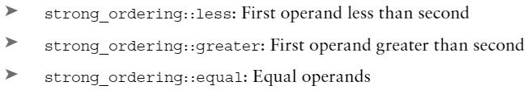
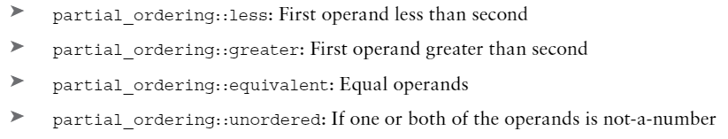
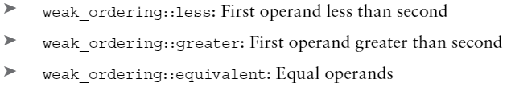

# Professional C++ 5th
[professional c++](https://www.amazon.com/Professional-C-Marc-Gregoire/dp/1119695406)

[cpp core guideline](https://github.com/isocpp/CppCoreGuidelines)

[cppreference.com](cppreference.com)

[microsoft guidline support library](https://github.com/Microsoft/GSL)

[iso cpp faq](https://isocpp.org/faq)

[C++17 Standard Library Quick Reference by Peter Van Weert and Marc Gregoire](https://www.amazon.com/Standard-Library-Quick-Reference-Structures/dp/1484249224)
## 第一部分 C++介绍
### 第一章 C++ 和标准库
枚举--`enum`，在使用过程中注意，虽然一个枚举变量对应的值是一个整数，但是不能直接和整数进行比较，需要进行转换。`C++20`可以使用`using enum`来声明使用枚举，不用使用完整的枚举类定义名前缀。
```cpp
enum class PieceType
{
    King = 1,
    Queen,
    Rook = 20,
    Pawn
};

using enum PieceType;
PieceType piece { King };  // 使用 King
```
建议总是使用强类型的`enum class`而不是旧的风格的`enum`，后者会将所有的枚举变量应用于全局，必须要保证命名唯一，不与其他的变量冲突。

三种结果的比较运算: `<=>`，用法[01/02.cpp](01/02.cpp)，适用在对象比较操作比较昂贵的情况。

整数比较结果
1. 整数比较结果--`std::strong_ordering`



2. 浮点数类型比较结果--`std::partial_ordering`



3. 自己实现`<=>`操作符返回类型--`std::weak_ordering`



以上结果可用`<compare>`中的检测方法，返回`true / false`
|方法|说明|
|----|----|
|std::is_eq()|==|
|is_neq()|!=|
|is_lt()|<|
|is_lteq()|<=|
|is_gt()|>|
|is_gteq()|>=|